#Taxi Service Application

##Project Description
► Multi Tier scalable web application which helps customers to book taxi on demand. Provides  functionality similar to Uber Taxi Services 
► Modules: 
&nbsp;&nbsp;&nbsp;&nbsp;&nbsp;&nbsp;-Customer: Reserves Taxi Services from source to destination.  
&nbsp;&nbsp;&nbsp;&nbsp;&nbsp;&nbsp;-Driver: Responds to customer's request and drives him to his destination  
&nbsp;&nbsp;&nbsp;&nbsp;&nbsp;&nbsp;-Admin: Monitors all drivers, customers, and stats like area wise revenue, number of rides in a particular area 
► Google Maps shows drivers available in 10 KM radius to the customer and he can see reviews of customer
► Dynamic price surge algorithm

##Technology Stack
► BackEnd: Node.js, ExpressJS, RESTful Web Service 
► Middleware: RabbitMQ 
► Caching: REDIS, Database Connection Pooling 
► FrontEnd: AngularJS, BootStrap, Google Maps, amCharts, HTML, CSS 
► Database: MySQL, MongoDB 
► Load and Performance Testing: JMeter 
  

##Project Architecture
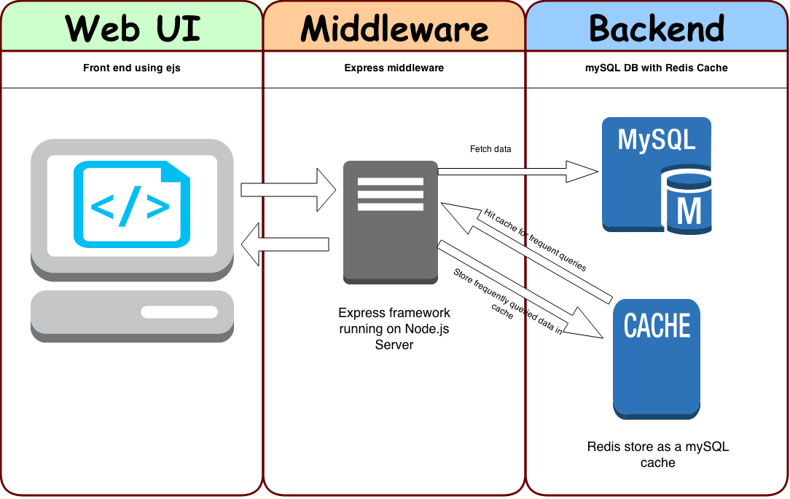

###Home Page

###Home Page
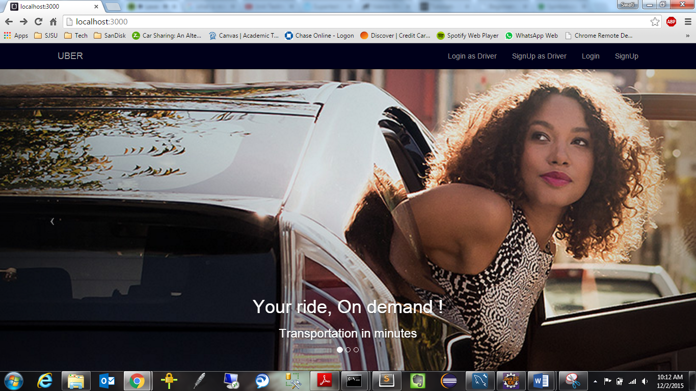

###Login Page
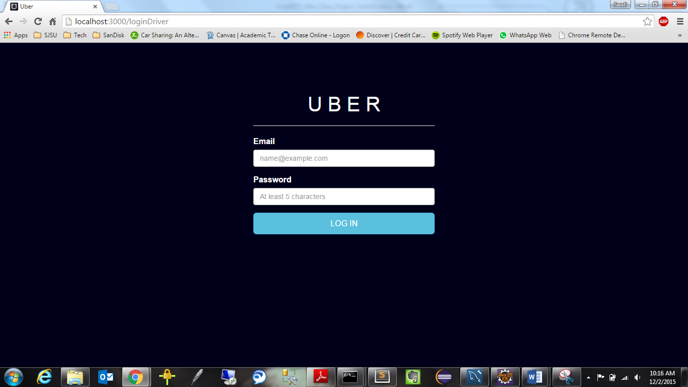

###Customer Landing Page
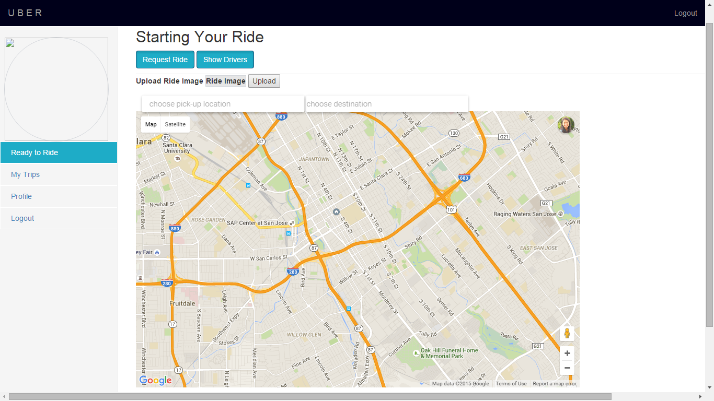

###Customer Area Radius Page
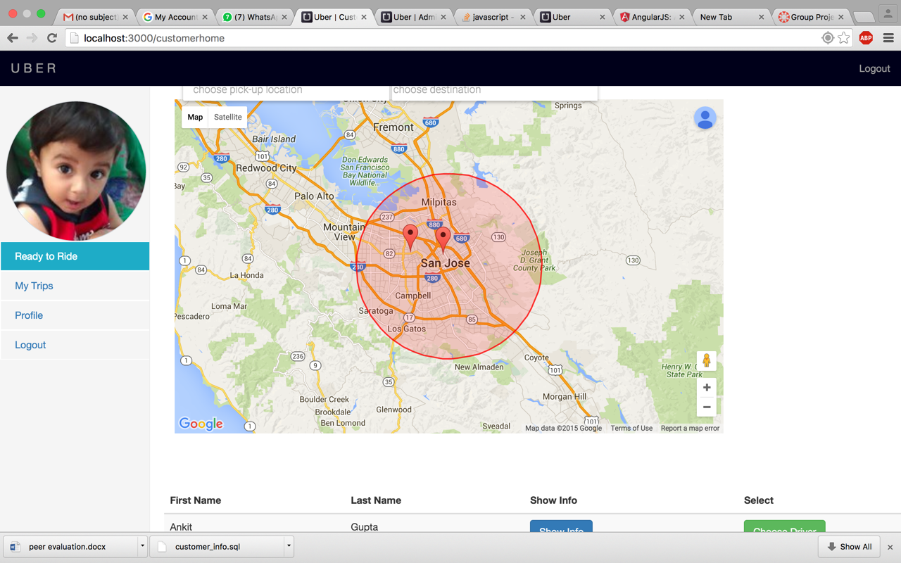

###Customer Ride Page
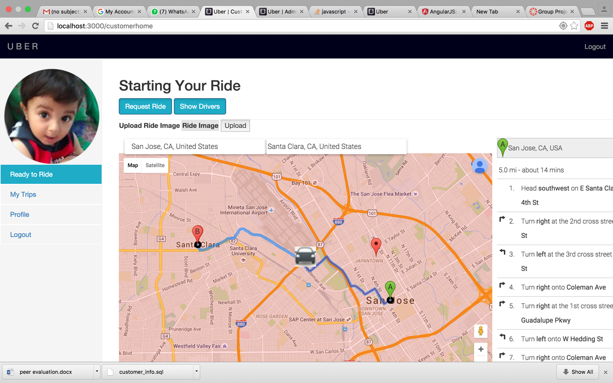

###Ride History Page

###Driver Landing Page
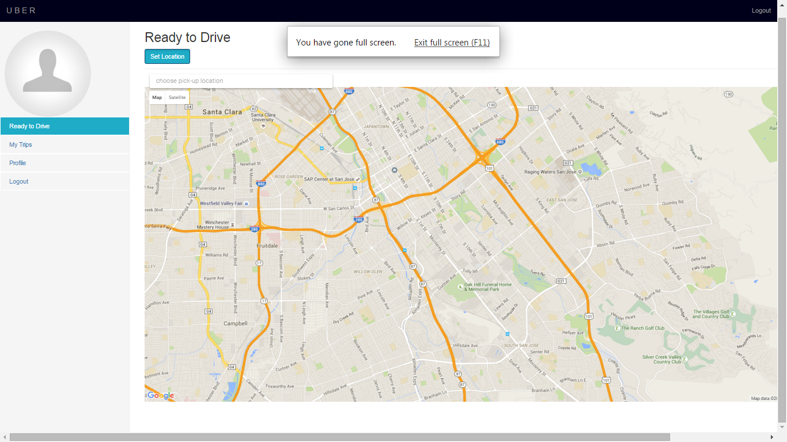

###Admin Dashboard
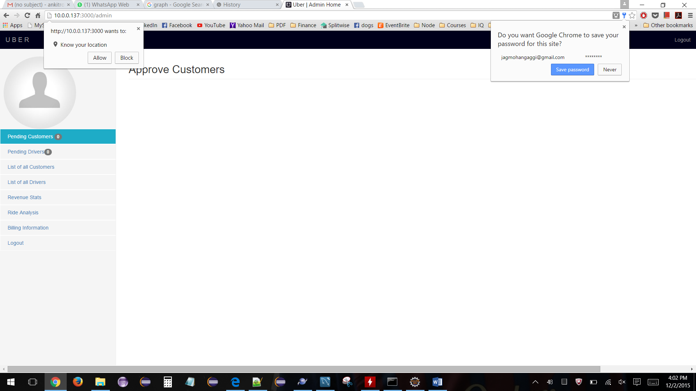

###Admin Lists all Drivers
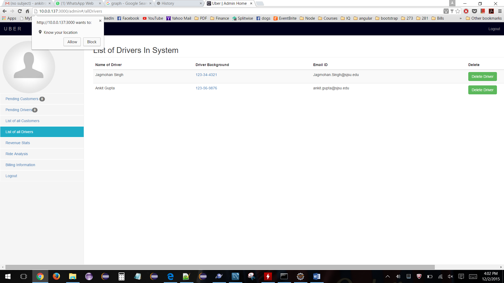

###Admin Lists all Customers
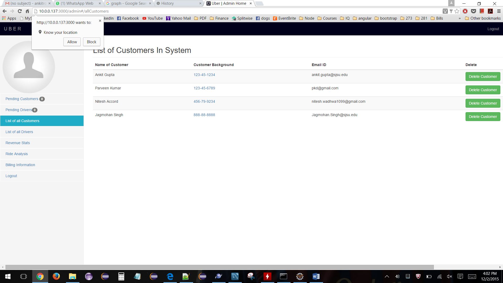

###Admin Stats Page
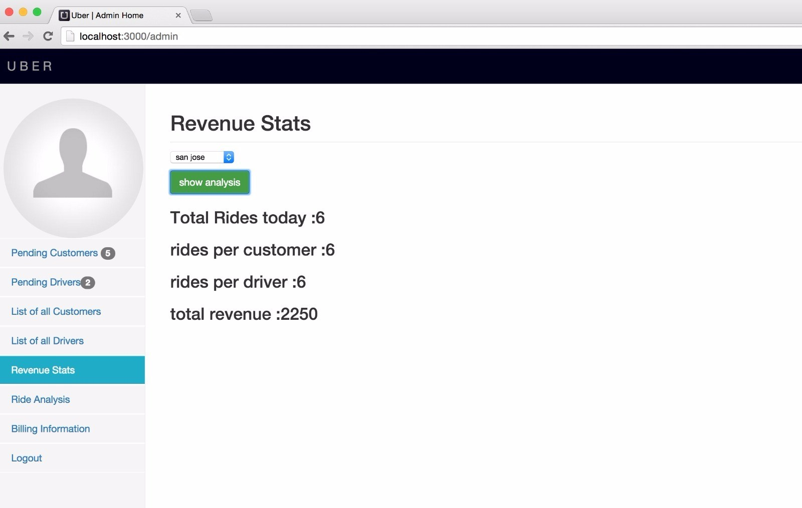

###10000 Database Records
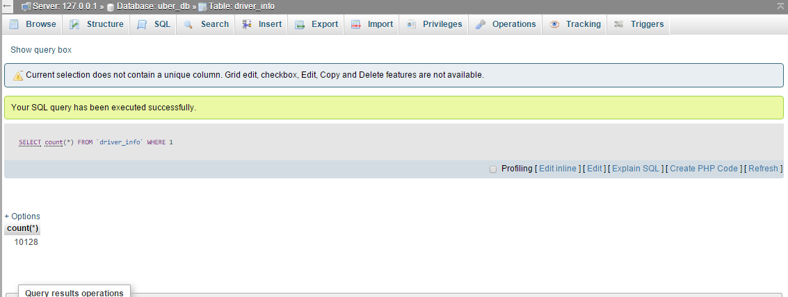

