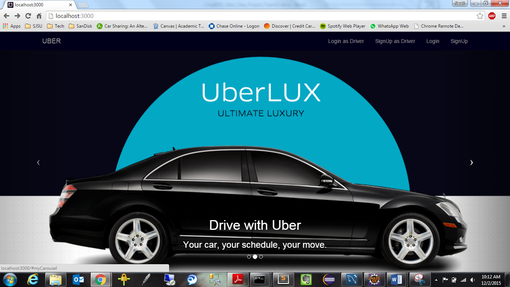
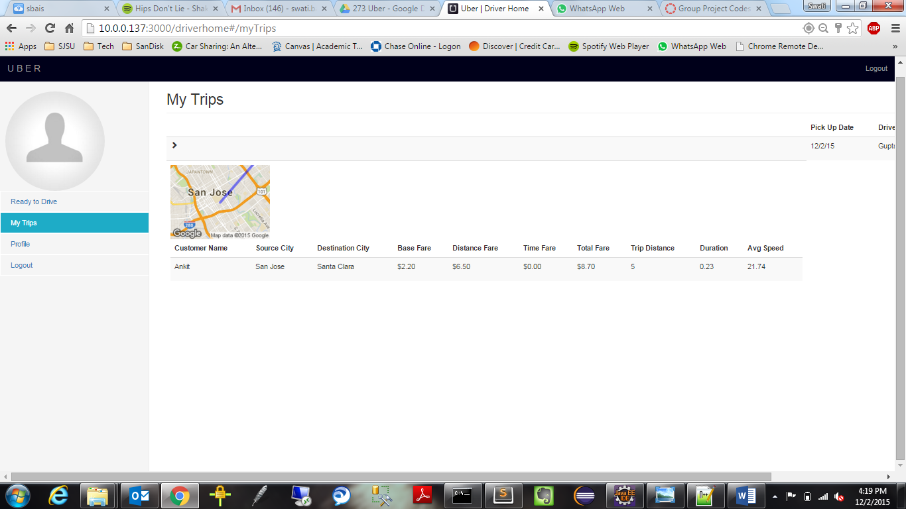

# UberTaxiService

##Taxi Service Application using RabbitMQ, Node.js, Redis, AngularJS, MongoDB, MySql

###project Architecture

###Home Page

###Home Page

###Login Page

###Customer Landing Page

###Customer Area Radius Page

###Customer Ride Page

###Ride History Page

###Driver Landing Page

###Admin Dashboard

###Admin Lists all Drivers

###Admin Lists all Customers

###Admin Stats Page

###10000 Database Records

